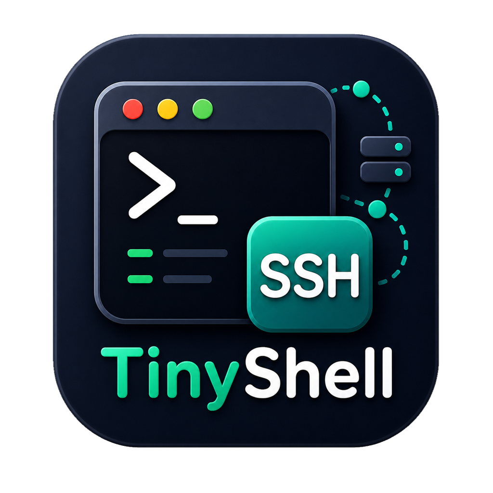

[中文](README.md) | [English](README.en.md)

<div align="center">



# TinyShell

**A modern cross-platform desktop terminal client built with Rust and GPUI**

Bring local terminals, SSH connection management, SFTP file operations, remote system monitoring, and configuration sync into one fast, focused workspace.

[](https://github.com/ynx-official/tiny-shell/releases/latest)
[](https://github.com/ynx-official/tiny-shell/actions/workflows/ci.yml)
[](LICENSE)
[](https://github.com/ynx-official/tiny-shell/releases/latest)

[Download the latest release](https://github.com/ynx-official/tiny-shell/releases/latest) · [View release history](docs/upgrade/README.md) · [Report an issue](https://github.com/ynx-official/tiny-shell/issues)

</div>


## About TinyShell

TinyShell is designed for developers, system administrators, and advanced users who work with both local shells and remote servers. It is built with [GPUI](https://github.com/zed-industries/zed) and [GPUI Component](https://github.com/longbridge/gpui-component), while its terminal core is powered by `alacritty_terminal`. The result combines low-latency terminal rendering with a native desktop experience and a unified connection workflow.

With TinyShell, you can:

- Open local terminals and organize tasks with tabs and split panes.
- Save, group, search, and quickly connect to SSH hosts.
- Browse and maintain remote files through the graphical SFTP panel.
- Inspect CPU, memory, network, disk, and process information on local or remote systems.
- Synchronize connection settings across devices through WebDAV or S3.
- Customize the workspace with themes, fonts, keybindings, and layout preferences.

## Contents

- [Core Capabilities](#core-capabilities)
- [Quick Start](#quick-start)
- [Installation](#installation)
- [Data and Security](#data-and-security)
- [Building from Source](#building-from-source)
- [Project Structure](#project-structure)
- [Version History](#version-history)
- [Technology Stack](#technology-stack)
- [License](#license)

## Core Capabilities

### Terminal Workspace

- **High-performance terminal emulation**: Powered by `alacritty_terminal`, with ANSI escape sequences, true color, cursor styles, and mouse events.
- **Tabs and split panes**: Organize sessions across multiple tabs and split a tab into multiple panes for a tmux-like workspace.
- **Consistent local and remote experience**: Local shells and SSH sessions share the same terminal interaction and visual model.
- **Terminal interaction**: Selection, copy and paste, context-menu actions, and terminal-aware mouse behavior.
- **Bundled font**: Includes Maple Mono NF CN for reliable CJK text and Nerd Font icon rendering.
- **Live appearance controls**: Change the terminal font, size, line spacing, and theme without restarting the application.

### SSH and Connection Management

- **Multiple authentication methods**: Passwords, private-key files, and inline private keys, including passphrase-protected keys.
- **Proxy connections**: SOCKS5 and HTTP proxies can be configured globally or per connection.
- **Tree-based connection catalog**: Organize large connection sets with groups, search, sorting, expansion controls, and moving.
- **Independent connection windows**: Quick connect, create/edit, group operations, moving, and archive import/export run in separate system windows without blocking the main workspace.
- **Isolated editing drafts**: Open multiple SSH create or edit windows at the same time, each with its own draft state.
- **Safe persistence**: Connection edits use atomic writes and optimistic concurrency checks to prevent one editor window from silently overwriting another.
- **Recycle-bin workflow**: Connections and groups support soft deletion and restoration, with deletion state preserved during synchronization.

### SFTP File Management

After an SSH connection is established, the built-in SFTP manager can handle remote files without requiring a separate client.

- Browse remote directories and jump directly to a path.
- Upload, download, and drag files.
- Select multiple files for batch operations.
- Create, rename, move, and delete files or directories.
- Inspect and change remote file permissions.
- Open and edit remote text files inside the application.
- Review transfer progress, history, and failure states.

### System Monitoring

- **Live telemetry**: CPU, memory, swap, network, and disk usage with historical trends.
- **Remote collection**: Automatically collect metrics after an SSH connection without installing an additional agent.
- **Process viewer**: Inspect remote processes and perform supported management actions.
- **Workspace integration**: Monitoring data follows the active session, making resource changes visible while terminal work is in progress.

### Configuration Sync and Migration

- **WebDAV and S3**: Synchronize connection and application settings through widely available storage backends.
- **Preflight validation**: Validate configuration and credentials before upload to reduce failures caused by incomplete settings.
- **Privacy-password verification**: Check the privacy password before synchronizing sensitive fields and detect missing or inconsistent passwords early.
- **Conflict-aware merging**: Synchronization metadata includes timestamps and deletion state for cross-device catalog merging.
- **Encrypted archives**: Export connections and groups to a password-protected TinyShell JSON archive and import it on another device.
- **Optional secret inclusion**: Choose whether exported archives include passwords, private keys, and proxy credentials.

### Themes and Productivity

- **Built-in themes**: Matrix, Gruvbox, Tokyo Night, Solarized, Phygerr, and more.
- **Custom themes**: Import JSON theme files to extend the available color schemes.
- **Light and dark modes**: Select an appearance suitable for the current environment.
- **Collapsible sidebar**: Free more screen space when focusing on the terminal.
- **Keybinding management**: View and edit shortcuts visually, with conflict detection.
- **Command palette**: Search sessions, files, and frequently used actions from one place.
- **Persistent layout**: Retain common workspace layouts and interaction preferences.
- **English and Chinese UI**: Switch the application interface between English and Simplified Chinese.

### Cross-Platform Auto-Update

TinyShell can check for and install releases from GitHub Releases. Downloaded update files are verified with SHA-256 before installation.

- **Windows**: Applies application replacement through a separate update script.
- **macOS**: Replaces the App Bundle or applies the installer package.
- **Linux**: Uses a temporary file and atomic executable replacement.

## Quick Start

1. Download the package matching your platform and architecture from the [Releases page](https://github.com/ynx-official/tiny-shell/releases/latest).
2. Start TinyShell and open a local terminal to verify your shell, font, and theme settings.
3. Create an SSH entry in the connection manager with the host, port, username, and authentication method.
4. After connecting, open SFTP and remote system monitoring from the same workspace.
5. To use the same connection catalog on multiple devices, configure WebDAV or S3 in Settings and set a privacy password for sensitive fields.

> Keep archive and privacy passwords in a safe place. TinyShell cannot decrypt an archive or synchronized sensitive fields when the password is incorrect.

## Installation

The current release workflow publishes the following artifacts:

| Platform | Architecture | Release artifacts |
| --- | --- | --- |
| Windows | x86_64 | `.exe` installer and portable `.zip` |
| macOS | Apple Silicon / Intel | `.pkg` installer and portable `.zip` |
| Linux | x86_64 | Generic `.tar.gz` |

### macOS

#### Homebrew (Recommended)

```bash
brew install ynx-official/taps/tiny-shell --cask
```

To update:

```bash
brew update && brew upgrade tiny-shell --cask
```

#### Install from Releases

Download the `macos-aarch64` or `macos-x86_64` artifact for your Mac:

- **Installer**: Download `tiny-shell-*-macos-*-setup.pkg` and follow the installer.
- **Portable**: Download `tiny-shell-*-macos-*-portable.zip`, extract it, and move `TinyShell.app` to Applications.

CI artifacts use ad-hoc signing. If macOS blocks the first launch, allow the application under **System Settings → Privacy & Security**. If macOS reports that the application is "damaged," run:

```bash
sudo xattr -cr /Applications/TinyShell.app
```

### Windows

Choose one of the following packages from the [Releases page](https://github.com/ynx-official/tiny-shell/releases/latest):

- **Installer**: Download `tiny-shell-*-windows-x86_64-setup.exe`. The setup wizard provides a Start Menu shortcut, an optional desktop shortcut, and a standard uninstall entry.
- **Portable**: Download `tiny-shell-*-windows-x86_64-portable.zip`, extract it, and run `tiny-shell.exe` without a traditional installation.

### Linux

Download `tiny-shell-*-linux-x86_64.tar.gz`, then run:

```bash
tar -xzf tiny-shell-*-linux-x86_64.tar.gz
cd tiny-shell-*-linux-x86_64
./tiny-shell
```

If your system is missing GPUI runtime dependencies, install the corresponding X11, Wayland, Fontconfig, FreeType, OpenGL, and GTK runtime libraries through your distribution's package manager.

> Debian package metadata is available in the repository, so developers can build a `.deb` with `cargo-deb`. The current GitHub Release workflow publishes a generic `.tar.gz` for Linux by default.

## Data and Security

TinyShell handles sensitive values such as SSH passwords, private keys, and proxy credentials. Keep the following boundaries in mind:

- Imported SSH keys are copied into application-managed storage, so removing the original file does not break existing connections.
- Configuration sync protects sensitive fields with a privacy password. Field encryption uses an Argon2id-derived key with XChaCha20-Poly1305 authenticated encryption.
- Connection archives require a non-empty password and use Argon2id with XChaCha20-Poly1305. Exported JSON does not contain sensitive fields in plaintext.
- Privacy-password verifiers cannot be used to recover the original password. Some device-bound encrypted state may require the password to be entered again on another device.
- Online updates verify downloaded files with SHA-256, but installation packages should still be obtained only from the official project Releases page.
- When synchronizing to WebDAV or S3, remote access control, availability, and data-retention policies remain the responsibility of the provider or deployment owner.

## Building from Source

### Requirements

- [Rust](https://www.rust-lang.org/tools/install) `1.85.0` or later.
- Cargo with Rust 2024 Edition support.
- Git for cloning the repository and fetching Git dependencies.
- Windows: MSVC Build Tools.
- macOS: Xcode Command Line Tools.
- Linux: C/C++ build tools plus the X11, Wayland, font, and graphics development libraries required by GPUI.

### Linux Build Dependencies

On Debian or Ubuntu, install the same packages used by CI:

```bash
sudo apt-get update
sudo apt-get install -y --no-install-recommends \
  build-essential pkg-config cmake \
  libfontconfig1-dev libfreetype6-dev \
  libxcb1-dev libxcb-render0-dev libxcb-shape0-dev libxcb-xfixes0-dev \
  libxkbcommon-dev libxkbcommon-x11-dev libwayland-dev \
  libgl1-mesa-dev libegl1-mesa-dev libgtk-3-dev \
  libudev-dev
```

### Clone and Run

```bash
git clone https://github.com/ynx-official/tiny-shell.git
cd tiny-shell
cargo run
```

Build an optimized binary:

```bash
cargo build --locked --release
```

### Quality Checks

CI runs formatting, Clippy, tests, and release builds on Windows, macOS, and Linux. Before submitting changes, run at least:

```bash
cargo fmt --all -- --check
cargo clippy --locked --all-targets -- -D warnings
cargo test --locked --all-targets
```

### Platform Packaging

macOS App Bundle:

```bash
./scripts/package-macos-app.sh
```

Windows installer and portable archive (requires Inno Setup 6):

```powershell
./scripts/package-windows.ps1
```

Optional Debian package:

```bash
cargo install cargo-deb
cargo deb
```

## Project Structure

```text
src/
├── app/       Application orchestration, windows, dialogs, settings, themes, and updates
├── backend/   Local terminal and SSH backends
├── crypto/    Shared cryptographic primitives for sync, archives, and configuration
├── session/   Session settings, connection catalog, storage, archives, and SSH keys
├── sftp/      SFTP file operations and remote text-file handling
├── sync/      WebDAV / S3 sync models, merging, and sensitive-field processing
├── system/    Local and remote system-information collection
├── terminal/  Terminal rendering, input, selection, and terminal semantics
└── main.rs    Application entry point

assets/        Icons, fonts, themes, and platform resources
locales/       English and Simplified Chinese localization resources
scripts/       macOS and Windows packaging scripts
docs/          Release history and focused technical documents
.github/       CI and cross-platform release workflows
```

The application layer coordinates windows, terminals, sessions, SFTP, synchronization, and system monitoring. Domain modules keep focused responsibilities and expose their capabilities through explicit interfaces.

## Version History

Current version: [`v1.1.7`](docs/upgrade/v1.1.7/README.md)

### v1.1.7

- Moved quick connect, group operations, connection moves, and archive import/export into independent system windows while keeping the main window interactive.
- Added multiple isolated SSH create/edit windows with separate drafts, atomic saves, and optimistic concurrency conflict detection.
- Improved the compact SSH editor layout and added `Esc` window closing.
- Automatically close the quick-connect window after connecting through double-click or menu actions.

### v1.1.6

- Upgraded quick connect into an independent tree-based connection manager.
- Added search, sorting, expand/collapse controls, context actions, and connection moving.
- Added soft deletion, recycle-bin restoration, and synchronized deletion state.
- Added password-encrypted TinyShell JSON connection archives.

### v1.1.5

- Added privacy-password verification to detect missing or mismatched synchronization passwords early.
- Improved sync settings, operation guidance, and latest-sync status visibility.

For complete release notes, upgrade guidance, and comparison links, see the [TinyShell release history](docs/upgrade/README.md).

## Technology Stack

| Area | Technology |
| --- | --- |
| Language | Rust 2024 Edition |
| GUI framework | [GPUI](https://github.com/zed-industries/zed) |
| Component library | [gpui-component](https://github.com/longbridge/gpui-component) |
| Async runtime | [Tokio](https://tokio.rs/) |
| Terminal engine | [alacritty_terminal](https://github.com/alacritty/alacritty) |
| Local pseudoterminal | [portable-pty](https://crates.io/crates/portable-pty) |
| SSH / SFTP | [russh](https://github.com/warp-tech/russh) / `russh-sftp` |
| Internationalization | [rust-i18n](https://github.com/longbridge/rust-i18n) |
| System information | [sysinfo](https://github.com/GuillaumeGomez/sysinfo) |
| Serialization | [Serde](https://serde.rs/) |
| HTTP client | [Reqwest](https://docs.rs/reqwest/) with rustls |
| Cryptography | Argon2id, XChaCha20-Poly1305, and SHA-256 |

## Contributing

Bug reports and suggestions are welcome through [Issues](https://github.com/ynx-official/tiny-shell/issues). Before submitting code, make sure that:

- Changes follow existing module responsibilities instead of placing cross-domain logic in terminal or entry-point modules.
- User-visible text is maintained in both `locales/zh-CN.yml` and `locales/en.yml`.
- Changes involving paths, processes, terminals, or windows account for Windows, macOS, and Linux differences.
- Formatting, Clippy, and tests pass.
- User configuration, build artifacts, debug logs, keys, and real service credentials are not committed.

## License

TinyShell is licensed under the [GPL-3.0-or-later](LICENSE) license.