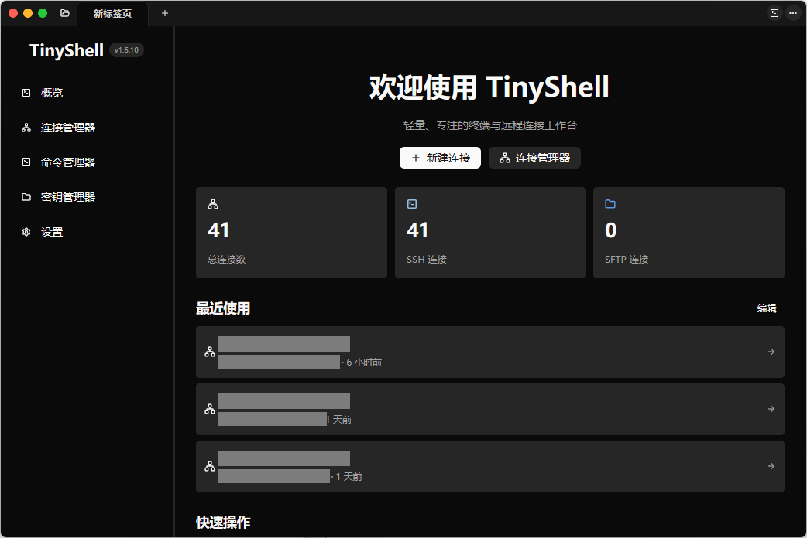
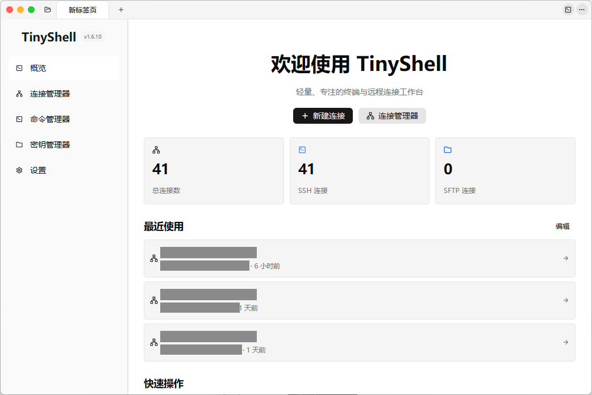
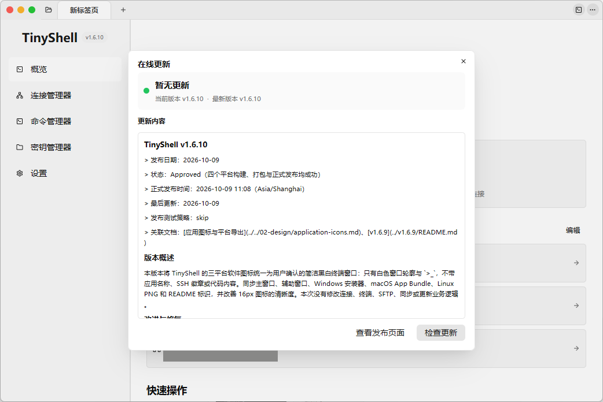

### 本地终端与远程连接，在一个工作区完成。

[](https://github.com/ynx-official/tiny-shell/releases/latest)
[](https://github.com/ynx-official/tiny-shell/actions/workflows/ci.yml)
[](LICENSE)
[](https://github.com/ynx-official/tiny-shell/releases/latest)

[下载 TinyShell](https://github.com/ynx-official/tiny-shell/releases/latest) · [English](README.en.md) · [文档中心](docs/README.md) · [更新日志](CHANGELOG.md) · [问题反馈](https://github.com/ynx-official/tiny-shell/issues)

## 功能亮点

🖥️ **统一终端工作区**：本地 Shell 与 SSH，支持多标签页、多窗口、Pane 分屏、选区与复制粘贴。

🗂️ **管理远程连接**：分组树、搜索与排序、独立连接编辑窗口、并发保存检查和连接回收站。

🔑 **按需连接**：支持密码、私钥与加密私钥认证，以及全局或单连接的 SOCKS5 / HTTP 代理。

📁 **内置 SFTP**：浏览目录、上传下载、拖拽与批量操作、修改文件权限、编辑远程文本，查看传输进度与历史。

📊 **监控系统与容器**：查看 CPU、内存、网络、磁盘与进程，管理当前会话所在主机的 Docker 容器和镜像。

🪟 **连接远程桌面**：Windows 使用系统 mstsc，macOS / Linux 可使用 FreeRDP 嵌入式后端。

🎨 **调整使用习惯**：深色与浅色模式、自定义主题、实时字体调整、快捷键、命令补全、内容高亮和布局持久化，支持中英文界面。

☁️ **同步与迁移**：WebDAV / S3 配置同步、WebDAV 自动对账与冲突合并，连接归档使用密码保护。

🔄 **在线更新**：从 GitHub Releases 检查新版本，下载文件经过 SHA-256 校验。

## 🌻 为什么使用 TinyShell

同时使用本地终端与多个远程服务器时，连接目录、文件传输和系统监控需要与当前会话一起管理。

TinyShell 将这些操作放在同一工作区：从连接目录进入终端，在当前会话旁处理文件、观察资源与管理容器，再通过标签页和分屏组织工作。

应用采用 **Rust + GPUI** 构建，支持 **Windows、macOS 和 Linux**。既可以管理远程服务器，也可以作为日常本地终端。

## 安装

从 [GitHub Releases](https://github.com/ynx-official/tiny-shell/releases/latest) 下载与你的平台和架构匹配的产物：

| 平台 | 架构 | 可选版本 |
| --- | --- | --- |
| Windows | x86_64 | 安装版 .exe、便携版 .zip |
| macOS | Apple Silicon / Intel | 基础版与 RDP 版，各提供 .pkg 和便携 .zip |
| Linux | x86_64 | 单文件 .AppImage、通用 .tar.gz |

### Windows

- **安装版**：下载 `tiny-shell-*-windows-x86_64-setup.exe`，按向导安装，可创建开始菜单与桌面快捷方式。
- **便携版**：下载 `tiny-shell-*-windows-x86_64-portable.zip`，解压后运行 `tiny-shell.exe`。

Windows 远程桌面使用系统自带的 `mstsc.exe`，无需安装 FreeRDP。

### macOS

Apple Silicon 选择 `macos-aarch64`，Intel 选择 `macos-x86_64`。

| 版本 | 文件名特征 | 适用场景 |
| --- | --- | --- |
| 基础版（推荐） | 不带 -rdp- | 使用终端、SSH 和 SFTP，包体更小 |
| RDP 版 | 带 -rdp- | 内置 FreeRDP，可连接 Windows 远程桌面 |

安装版下载 .pkg 并按向导安装；便携版下载 .zip，解压后将 `TinyShell.app` 放入“应用程序”。两种版本都安装为 `TinyShell.app`，会相互覆盖，同一台 Mac 上建议保留一个版本。

CI 产物使用临时签名。首次启动被阻止时，可在“系统设置 → 隐私与安全性”中允许应用运行；若系统提示应用“已损坏”，可执行：

```bash
sudo xattr -cr /Applications/TinyShell.app
```

### Linux

推荐使用 AppImage，赋予执行权限后直接启动：

```bash
chmod +x tiny-shell-*-linux-x86_64.AppImage
./tiny-shell-*-linux-x86_64.AppImage
```

应用内更新器可识别 AppImage，校验 SHA-256 后原子替换外层文件并重新启动。系统没有 FUSE 2 兼容层时，可安装对应软件包（Ubuntu 24.04 为 `libfuse2t64`），或使用 .tar.gz：

```bash
tar -xzf tiny-shell-*-linux-x86_64.tar.gz
cd tiny-shell-*-linux-x86_64
./tiny-shell
```

Linux 发布以 Ubuntu 24.04 的 glibc 为基线。AppImage 携带 FreeRDP / WinPR 及非系统依赖，不捆绑 glibc、显卡驱动或 Mesa / Vulkan；缺少图形与字体运行库时，需通过发行版包管理器安装。

仓库也保留 Debian 包元数据，可通过 `cargo-deb` 从源码生成 .deb，详见[构建与打包](docs/05-operations/build-and-package.md#平台打包)。

## ✨ 使用与预览

安装后，可以从下面三个场景开始。截图中的连接名称、账号、主机地址和端口均已脱敏。

### 🖥️ 打开第一个终端与 SSH 会话

1. 启动 TinyShell，打开本地终端，确认 Shell、字体和主题显示正常。
2. 在连接管理器中新建 SSH 连接，填写主机、端口、用户名与认证方式。
3. 连接成功后，在同一工作区打开 SFTP、系统监控或 Docker 面板。

使用标签页、分屏与连接分组组织多个会话，按需调整快捷键和工作区布局。



### 🎨 调整主题与工作区

根据使用环境选择浅色或深色模式，也可以导入自定义主题。终端字体、字号、行间距与主题支持实时调整，无需重启。

需要专注终端时，可以折叠侧边栏或使用纯净工作区；常用布局会随配置保存。



### 🔄 查看版本与在线更新

在应用内检查新版本，查看当前版本状态和更新内容；也可以从 [Releases 页面](https://github.com/ynx-official/tiny-shell/releases/latest) 下载适合的平台安装包。



## ⚡ 终端交互与效率

终端支持 ANSI转义序列、真彩色、光标样式和鼠标事件。界面跟随系统字体，终端在 Windows 优先使用 Consolas、macOS 优先使用 Menlo，并自动补充已安装的中文与 Emoji 字体；使用 Powerline 图标时需自行安装并选择 Nerd Font。

[内容高亮](docs/02-design/terminal-content-highlighting.md)包含 28 条内置规则，支持作用域、捕获组、命中解释和 JSON 导入导出。按住 Ctrl（macOS 为 Command）点击可打开 URL、邮箱或本地路径，也可复制远程路径与网络标识；原有终端配色与全屏 TUI 样式保持不变。

## 🔐 数据与安全

- **私钥托管**：导入的 SSH 私钥会复制到应用管理的存储中，删除原始文件不会影响已有连接。
- **敏感字段加密**：配置同步使用隐私密码，采用 Argon2id 派生密钥与 XChaCha20-Poly1305 认证加密。
- **归档保护**：连接归档要求非空密码，导出的 JSON 不直接保存明文密码、私钥或代理凭据。
- **密码与设备**：隐私密码校验值不能用于恢复原密码；更换设备后，部分与本机绑定的状态可能需要重新输入密码。
- **更新来源**：SHA-256 用于验证文件完整性，安装包仍应只从项目官方 Releases 获取。
- **远端存储**：WebDAV / S3 的访问控制、可用性和数据保留策略由服务提供方或部署者负责。

## ❓ 常见问题

### macOS 基础版与 RDP 版怎么选？

使用本地终端、SSH 和 SFTP 时选择基础版；需要连接 Windows 远程桌面时选择 RDP 版。两个版本都安装为 TinyShell.app，会相互覆盖，详见 [macOS 安装](#macos)。

### Windows 远程桌面需要安装 FreeRDP 吗？

无需安装。Windows 使用系统自带的 mstsc.exe；FreeRDP 后端用于 macOS / Linux。

### Linux 上 AppImage 无法运行怎么办？

先检查 FUSE 2 兼容层和系统图形、字体运行库，也可以使用 .tar.gz。Linux 发布以 Ubuntu 24.04 的 glibc 为基线，具体步骤见 [Linux 安装](#linux)。

### 忘记隐私密码或连接归档密码，可以恢复吗？

TinyShell 无法通过密码校验值恢复原密码，也无法在密码错误或遗失时解密对应的敏感字段。请妥善保存密码；更换设备后，部分与本机绑定的状态需要重新输入密码。

## 👨‍💻 开发

准备 **Rust 1.85.0+、支持 Rust 2024 Edition 的 Cargo 和 Git**，并安装平台构建工具：

| 平台 | 构建准备 |
| --- | --- |
| Windows | MSVC Build Tools；RDP 使用系统 mstsc |
| macOS | Xcode Command Line Tools；RDP 后端按需安装 FreeRDP 3 |
| Linux | C/C++ 工具链及 GPUI 图形、字体开发库；RDP 后端按需安装 FreeRDP 3 |

```bash
git clone https://github.com/ynx-official/tiny-shell.git
cd tiny-shell
cargo run --locked
```

### 常用命令

| 命令 | 用途 |
| --- | --- |
| `cargo run --locked` | 从源码启动，默认在 macOS / Linux 自动查找 FreeRDP |
| `cargo run --locked --no-default-features` | 启动不包含 FreeRDP 后端的版本 |
| `cargo run --locked --features freerdp` | 在 macOS / Linux 强制启用 FreeRDP，缺少依赖时构建失败 |
| `cargo build --locked --release` | 构建优化版本 |
| `cargo fmt --all -- --check` | 检查 Rust 格式 |
| `cargo clippy --locked --all-targets -- -D warnings` | 执行静态检查，warning 视为错误 |
| `cargo test --locked --all-targets` | 运行所有目标的测试 |

项目 CI 在 Windows、macOS 和 Linux 上执行质量检查与 release 构建；Ubuntu 24.04 门禁还会生成、解包并通过 Xvfb 冒烟启动 AppImage。完整平台依赖、FreeRDP 选项与打包命令见[构建与打包](docs/05-operations/build-and-package.md)。

### 项目结构

```text
src/
├── app/       应用编排、窗口、对话框、设置、主题和更新
├── backend/   本地终端与 SSH 后端
├── crypto/    同步、归档与配置使用的共享加密原语
├── session/   会话配置、连接目录、存储、归档和密钥
├── sftp/      文件操作与远程文本编辑
├── sync/      WebDAV / S3 同步、合并与敏感字段处理
├── system/    本地与远程系统信息采集
├── terminal/  终端渲染、输入、选区与终端语义
└── main.rs    应用入口

assets/        图标、主题、预览图和平台资源
locales/       中文与英文国际化资源
tests/         集成与回归测试
scripts/       构建、打包与发布工具
docs/          设计、运维与版本记录
.github/       CI 与跨平台发布流水线
```

应用层协调各领域模块；终端模块保持终端语义，不混入 SSH 或持久化逻辑。

### 技术栈

| 领域 | 技术 |
| --- | --- |
| 语言与界面 | Rust 2024、[GPUI](https://github.com/zed-industries/zed)、[gpui-component](https://github.com/longbridge/gpui-component) |
| 异步与终端 | [Tokio](https://tokio.rs/)、[alacritty_terminal](https://github.com/alacritty/alacritty)、[portable-pty](https://crates.io/crates/portable-pty) |
| SSH / SFTP | [russh](https://github.com/warp-tech/russh)、russh-sftp |
| 数据与系统 | Serde、[sysinfo](https://github.com/GuillaumeGomez/sysinfo)、[rust-i18n](https://github.com/longbridge/rust-i18n) |
| 网络与加密 | Reqwest + rustls、Argon2id、XChaCha20-Poly1305、SHA-256 |

## 📚 文档

- [文档中心](docs/README.md)：设计方案与专项说明。
- [构建与打包](docs/05-operations/build-and-package.md)：平台依赖、源码运行、质量检查与安装包生成。
- [版本记录](docs/upgrade/README.md)与[更新日志](CHANGELOG.md)：当前版本与历次发布详情。
- [协作规范](AGENTS.md)：模块职责、代码质量、跨平台约定与贡献要求。

## 💙 参与贡献

欢迎通过 [Issues](https://github.com/ynx-official/tiny-shell/issues) 报告可复现的问题或提出功能建议，也欢迎提交 Pull Request。

贡献前请阅读协作规范，按改动范围执行格式、Clippy 与测试；用户可见文案需同步维护中英文资源，涉及路径、进程和窗口时需考虑三个平台。不要提交用户配置、构建产物、调试日志、密钥或真实服务凭据。

## ⭐ 支持项目

如果 TinyShell 对你有帮助，欢迎为[项目仓库](https://github.com/ynx-official/tiny-shell)点一个 Star。

## 🍁 许可证

本项目使用 [GPL-3.0-or-later](LICENSE) 许可证。
