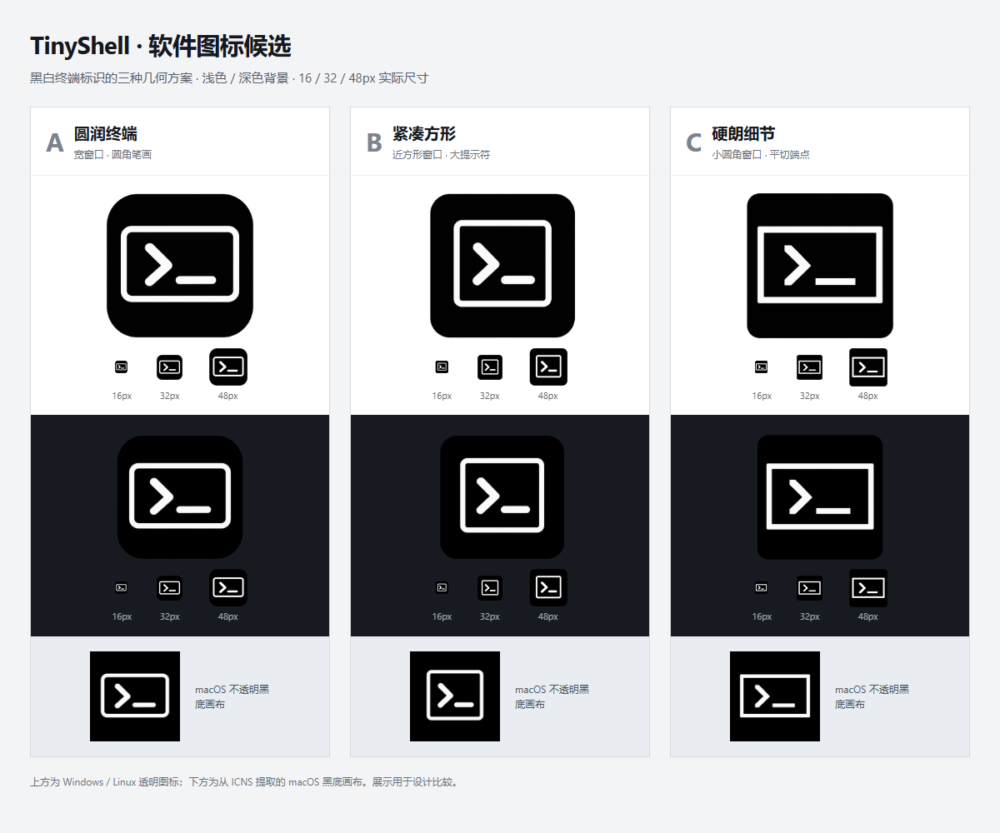

# 软件图标候选方案

> 状态：Approved
> 最后更新：2026-10-10
> 关联：[当前应用图标与平台导出](application-icons.md)、[文档索引](../README.md)、[完整生成提示与产物清单](../../assets/icons/candidates/2026-10-10/manifest.json)

## 目标与方案

根据用户要求，为 Windows、macOS、Linux 软件图标生成三套可比较的候选。沿用黑白终端窗口与 `>_` 标识，通过窗口比例、圆角和笔画形状区分方案；不包含应用名称、SSH 徽章、代码行、彩色控制点、渐变或阴影。

本页记录候选素材；当前正式应用图标的权威说明仍为[应用图标与平台导出](application-icons.md)。

## 选择结果

用户于 2026-10-10 明确回复「第一种」，选定 A「圆润终端」。A 已应用到正式窗口 PNG、Windows ICO、macOS ICNS、Linux PNG 和两个平台母图，并同步 README 头图中的标识。B、C 作为比较素材保留；正式图标与最新验证结果统一见[应用图标与平台导出](application-icons.md)。

| 方案 | 特征 | 1024px 预览 | Windows ICO | macOS ICNS | Linux PNG |
| --- | --- | --- | --- | --- | --- |
| A 圆润终端 | 横向窗口、圆角笔画、较宽下划线 | [PNG](../../assets/icons/candidates/2026-10-10/rounded-terminal/tiny-shell.png) | [ICO](../../assets/icons/candidates/2026-10-10/rounded-terminal/tiny-shell.ico) | [ICNS](../../assets/icons/candidates/2026-10-10/rounded-terminal/tiny-shell.icns) | [256px PNG](../../assets/icons/candidates/2026-10-10/rounded-terminal/256x256/tiny-shell.png) |
| B 紧凑方形 | 更接近方形的窗口、大提示符、紧凑留白 | [PNG](../../assets/icons/candidates/2026-10-10/compact-square/tiny-shell.png) | [ICO](../../assets/icons/candidates/2026-10-10/compact-square/tiny-shell.ico) | [ICNS](../../assets/icons/candidates/2026-10-10/compact-square/tiny-shell.icns) | [256px PNG](../../assets/icons/candidates/2026-10-10/compact-square/256x256/tiny-shell.png) |
| C 硬朗细节 | 小圆角窗口、平切箭头与矩形下划线 | [PNG](../../assets/icons/candidates/2026-10-10/angular-terminal/tiny-shell.png) | [ICO](../../assets/icons/candidates/2026-10-10/angular-terminal/tiny-shell.ico) | [ICNS](../../assets/icons/candidates/2026-10-10/angular-terminal/tiny-shell.icns) | [256px PNG](../../assets/icons/candidates/2026-10-10/angular-terminal/256x256/tiny-shell.png) |

## 对比预览

## 平台适配

- Windows：1024px 窗口 PNG；ICO 包含 16、20、24、32、40、48、64、128、256px，保留透明四角。
- Linux：256px PNG，保留透明轮廓与足够的图形占比。
- macOS：各尺寸合成至全不透明黑底，由系统处理外形；ICNS 小尺寸使用 ARGB / RLE，较大尺寸使用 PNG。
- 生成母图与各平台输入副本保存在每个候选的 `source/` 中；ICO 各尺寸与 ICNS 1024px 原始载荷另存于 `preview/`，方便复核。

候选生成时复用现有 `scripts/generate-icons.ps1`，在 `target/` 中使用隔离副本，输入与输出均指向候选目录。A 使用标准导出；B 的 Windows/Linux 安全边距从 2% 减至 1%，提高小尺寸占比；C 的 16px 灰阶对比补偿从 1.2 倍增至 1.4 倍。候选阶段没有修改正式图标，选择 A 后直接采用标准导出的 A 素材；原导出脚本保持原样。

## 生成记录

使用内置 `imagegen`，以当前黑白母图为品牌参考，分别生成三张透明背景 PNG。共同提示为：单个黑色应用图块，白色终端窗口和 `>_`，简洁粗线条，黑白灰阶，适合 16/32/48px，无名称与装饰。

三版差异提示分别为：A 宽窗口与圆润端点；B 接近方形的紧凑窗口与更大的提示符；C 小圆角窗口、平切箭头和直线下划线。完整英文提示保存在[产物清单](../../assets/icons/candidates/2026-10-10/manifest.json)中。

## 验证结果

复用 `tests/app_icon_contract.rs` 的六项素材检查，在 `target/` 中为每套候选编译测试副本，仅替换图片常量的输入路径，保持断言原样。

| 方案 | 检查结果 |
| --- | --- |
| A 圆润终端 | 6 项通过，0 项失败 |
| B 紧凑方形 | 6 项通过，0 项失败 |
| C 硬朗细节 | 6 项通过，0 项失败 |

- 覆盖窗口/Linux PNG、ICO 各尺寸的可见占比、透明四角、黑白灰阶、底部无名称，ICNS 小尺寸 ARGB/RLE 编码与像素一致性，以及 macOS 全不透明黑底；共 18 项通过。
- B 首次标准导出在 20px 与 1024px 下可见高度不足，减小候选安全边距后通过原有检查。C 首次 macOS 16px 最亮像素仅为 221/255，调整小尺寸对比补偿后通过原有检查。
- 桌面与 390px 窄屏比较页共展示 27 张实际导出图片，均加载成功，无页面横向溢出；已视觉复核浅色、深色与 16/32/48px 展示。
- 候选生成阶段的 `git diff --check` 通过；该阶段没有修改正式应用图标、README 与导出脚本，也没有运行应用构建。选择 A 后的当前工作区验证单独记录于[应用图标与平台导出](application-icons.md)。

原生桌面外观仍需在对应系统上验证；本页的画布和小尺寸预览不等同于 macOS / Linux 原生桌面验证。
