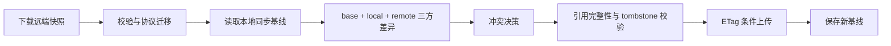

# WebDAV 配置同步架构

> 状态：一期基础设施设计与实施基线
>
> 当前运行协议：`schema_version = 2`
>
> 目标协议：`schema_version = 3`

## 1. 问题与目标

当前同步包使用随机 UUID 作为 `ManagedKey.id`，而不同设备导入同一私钥时 UUID 不同。仅按 UUID 合并会产生重复密钥，连接中的 `managed_key_id` 也会指向另一台设备的密钥。短期修复已经在同步领域层完成了 fingerprint 去重、引用重写和上传/下载方向化策略。

方向化策略是稳定层，不是最终冲突模型。它只能表达“这次操作由哪一侧优先”，无法判断某个实体到底是本地修改、远端修改还是双方同时修改。本架构的最终目标是使用上次成功同步的 `base`，对 `local` 和 `remote` 做三方比较。

## 2. 目标数据流



每次自动同步和手动同步都复用同一条管线。任何一步失败都不能更新基线；远端条件写入失败时必须重新下载、重新合并，禁止无条件覆盖其他设备的新内容。

## 3. 协议版本

### 3.1 v2 兼容层

v2 是当前线上格式。其顶层包含 `revision`、`updated_at`、`device_id` 和实体数组，但实体本身没有逐项版本信息。v2 继续用于现有上传、下载和短期方向化合并，旧数据必须能够读取。

v1/v2 解析属于协议模块职责，不应继续扩散到 UI 或 WebDAV 后端。v2 的秘密字段状态、旧加密信封和当前 `SyncPayload` 导出接口保持兼容。

### 3.2 v3 目标格式

v3 在协议边界增加以下概念：

```text
EntityVersion {
    generation: u64,
    device_id: String,
    updated_at: i64,
}
```

- `generation` 表示同一实体的逻辑演进次数。
- `device_id` 用于确定并列版本和诊断来源。
- `updated_at` 用于展示以及版本完全相同时的确定性排序，不单独作为冲突真相。
- 三方合并首先比较 `base` 内容与当前内容；时间戳不能替代内容比较。

稳定实体 ID：

- `Session.id` 是连接实体主键。
- `ManagedKey.id` 是密钥实体主键。
- 连接组、快捷命令分类和命令均使用实体 ID，不使用名称作为主键。
- `ManagedKey.fingerprint` 是非空时的内容身份和跨设备去重依据，不替代 `ManagedKey.id`。

## 4. 三方合并规则

对每个实体分别计算：

| base | local | remote | 结果 |
| --- | --- | --- | --- |
| 未变 | 已变 | 未变 | 使用 local |
| 未变 | 未变 | 已变 | 使用 remote |
| 未变 | 已变 | 已变且相同 | 使用共同结果 |
| 未变 | 已变 | 已变且不同 | 进入冲突决策 |
| 已删除 | 未恢复 | 已删除 | 保留 tombstone |
| 已删除 | 恢复 | 未变 | 进入删除/恢复冲突决策 |

冲突决策必须是独立模块，不能通过继续增加 `MergePreference` 枚举解决。默认策略可以按实体字段定义，但必须产生可观测的冲突记录，供后续 UI 展示或用户选择。

## 5. 身份、引用与规范化

密钥合并顺序固定为：

1. 按实体 ID 精确匹配。
2. 两侧 fingerprint 均非空且相同，识别为同一密钥。
3. 为本地旧 ID 和远端旧 ID 建立规范 ID 别名表。
4. 合并连接和删除快照前重写 `managed_key_id`。
5. 最终校验所有引用都指向有效密钥；无效引用必须被清除或产生可恢复错误，不能把悬空引用写回配置。

空 fingerprint 不参与跨设备去重。删除密钥时必须在后续阶段明确采用阻止删除、解除关联或级联处理之一；一期只保证同步引用校验，不改变密钥删除 UI。

## 6. Tombstone

所有可同步实体统一使用 tombstone，至少包含：

- 实体类型
- 实体 ID
- `EntityVersion`
- 删除时间
- 可选的恢复所需最小快照

一期不清理历史 tombstone。后续必须定义保留周期、设备确认水位和恢复语义，避免一台长期离线设备重新上传已删除实体。

## 7. 本地同步基线

基线不写入 `sessions.json`，而写入配置目录下独立的 `sync-state.json`。一个文件可以保存多个同步目标，每个目标以规范化后端参数定位；持久化索引使用哈希，避免直接把服务器地址写入索引。

基线内容包括：

- v3 稳定快照
- 远端 `revision`
- 远端 `ETag`
- 成功同步时间
- 协议版本

基线必须使用现有硬件绑定加密机制加密保存。临时文件写入、`sync_all`、原子替换和 Unix `0600` 权限与主配置一致。损坏或硬件密钥不匹配时只返回错误，不删除或覆盖旧基线。

一期只实现仓库读写和协议类型，不接入上传成功回调。这样可以先验证存储边界，避免在三方合并尚未上线时保存不具备语义的“半基线”。

## 8. 并发与失败恢复

- 下载使用远端 `ETag` 作为基线关联。
- 上传使用 `If-Match`；远端不存在时使用 `If-None-Match: *`。
- 收到 `412` 或等价冲突响应时重新下载并重新合并。
- 远端上传成功后，只有本地应用配置和基线都成功保存，下一次同步才把本次快照视为完整成功。
- 任一持久化失败都保留旧基线，并记录可诊断错误。

## 9. 迁移路线

1. **一期：基础设施**
   - 文档、协议模块、v1/v2 到 v3 纯迁移、硬件绑定字节信封、独立基线仓库。
   - 继续使用 v2 远端格式和当前方向化合并。
2. **二期：纵向切片**
   - `Session + ManagedKey` 接入 base/local/remote 三方 diff。
   - 引用完整性校验成为合并管线硬门槛。
3. **三期：完整实体与删除**
   - 连接组、快捷命令、统一 tombstone、删除和恢复策略。
4. **四期：产品化切换**
   - 冲突 UI、自动决策策略、tombstone 清理和 v3 远端写入。
   - 经过双设备、离线编辑、并发上传、删除/恢复和旧数据升级测试后，才移除方向化稳定层。

## 10. 兼容性矩阵

| 来源 | 读取 | 迁移目标 | 写回 |
| --- | --- | --- | --- |
| v1 | 支持 | v3 内部快照 | 仍按当前调用路径写 v2 |
| v2 | 支持 | v3 内部快照 | 仍写 v2 |
| v3 | 一期支持类型和基线 | v3 | 二期以后启用 |

一期不修改应用版本号、远端文件名、用户配置格式、同步设置文案或自动同步周期。

## 11. 验收标准

- 协议迁移为纯函数，重复执行结果稳定，不生成新的实体 ID。
- 基线按同步目标隔离，不能因更换 WebDAV endpoint 或 S3 object key 误用旧快照。
- 基线加密字节不包含会话密码、私钥、passphrase、代理密码或托管密钥正文。
- 现有 v2 解析、方向化合并和 WebDAV ETag 行为不变。
- `cargo fmt`、Clippy、协议/基线/合并测试和全量测试通过。